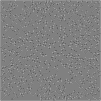

# Recursive Maze Solver - Visualized

### Description

* This script will take a 'N by N' (pixels) png of a maze that has a 1-pixel-wide wall and a 1-pixe-wide path, and find the solution. 
* It utilizes recursive backtracking to find the solution.
* The solution will be highlighted in green, and all traversed paths are highlighted in purple. 

### Usage

Drop an NxN pixel PNG of a maze with a 1-pixel-wide path and 1-pixel-wide walls named "maze.png" and execute the script.

#### Example Input:

#### Example Output:

